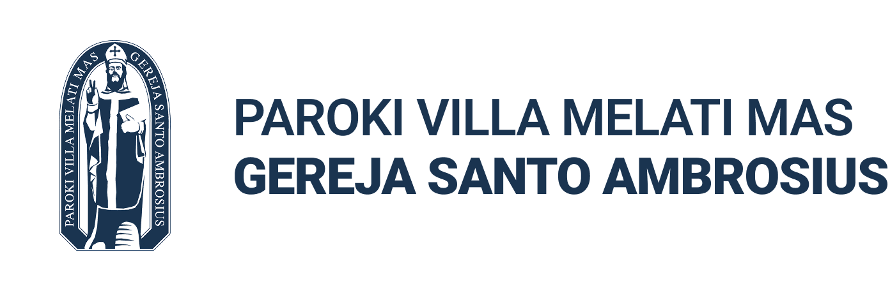

# Gereja Santo Ambrosius - Official Website



A modern church website built with Next.js 15, Payload CMS 3.0, and MongoDB, featuring content management for news articles, spiritual reflections, and parish information.

## 🏛️ About

The official website for Gereja Santo Ambrosius (Saint Ambrose Church) - "Paguyuban umat beriman yang peduli, berbagi dan merakyat" (A congregation of faithful believers who care, share, and serve the people).

## 🛠️ Tech Stack

- **Frontend**: Next.js 15 with React 19
- **CMS**: Payload CMS 3.0 with Lexical Rich Text Editor
- **Database**: MongoDB with Mongoose
- **Styling**: Tailwind CSS 4.0
- **Media Storage**: Payload Cloud (with support for self-hosted alternatives)
- **Monitoring**: Sentry integration
- **Testing**: Playwright (E2E) + Vitest (Integration)
- **Package Manager**: pnpm

## 📚 Documentation

Comprehensive documentation is available in the `/docs` folder:

- **[Administrator Guide](./docs/admin-guide.md)** - Content management and admin panel usage
- **[Deployment Guide](./docs/deployment.md)** - Production deployment with Docker, MongoDB, and Nginx
- **[Storage Guide](./docs/storage.md)** - Media storage options and migration strategies
- **[API Documentation](./docs/api.md)** - REST and GraphQL API reference
- **[Development Guide](./docs/development.md)** - Local development and contribution guidelines
- **[Troubleshooting](./docs/troubleshooting.md)** - Common issues and solutions

## 🏗️ Project Structure

```
santo-ambrosius/
├── src/
│   ├── app/                    # Next.js app router
│   │   ├── (frontend)/         # Public-facing pages
│   │   └── (payload)/          # CMS admin and API routes
│   ├── collections/            # Payload CMS collections
│   ├── components/             # React components
│   ├── lib/                    # Utility functions
│   └── styles/                 # Global styles
├── public/                     # Static assets
├── docs/                       # Documentation
├── tests/                      # Test suites
├── docker-compose.yml          # Development Docker setup
├── Dockerfile                  # Production Docker image
└── payload.config.ts           # Payload CMS configuration
```

## 🤝 Contributing

1. Fork the repository
2. Create a feature branch: `git checkout -b feature/new-feature`
3. Make your changes and test thoroughly
4. Commit your changes: `git commit -m 'Add new feature'`
5. Push to the branch: `git push origin feature/new-feature`
6. Submit a pull request

### Development Guidelines

- Follow the existing code style and patterns
- Write tests for new features
- Update documentation for any changes
- Ensure all tests pass before submitting PR
- Use conventional commit messages

## 📄 License

This project is licensed under the MIT License - see the [LICENSE](LICENSE) file for details.

## 🆘 Support

- **Documentation**: Check the `/docs` folder for detailed guides
- **Issues**: Report bugs or request features via GitHub Issues
- **Community**: Join our parish community discussions

## 🙏 Acknowledgments

- Built with [Payload CMS](https://payloadcms.com/) - The best TypeScript CMS
- [Next.js](https://nextjs.org/) - The React Framework for Production
- [Tailwind CSS](https://tailwindcss.com/) - A utility-first CSS framework
- Parish community of Gereja Santo Ambrosius for their support and feedback

---

**Gereja Santo Ambrosius** - Paguyuban umat beriman yang peduli, berbagi dan merakyat.